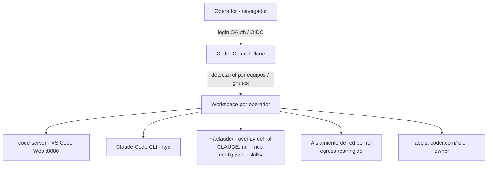
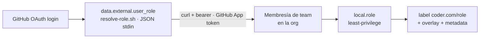
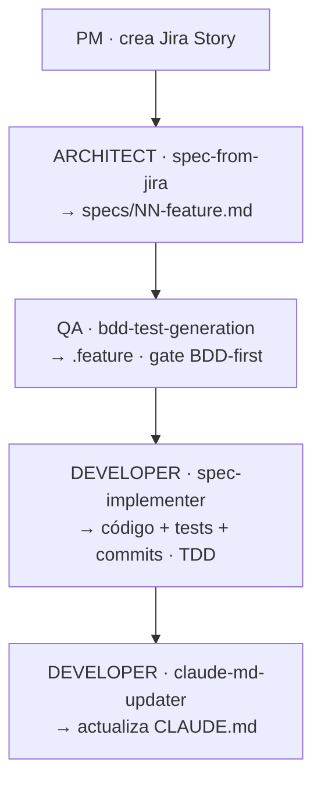

# Manual Técnico — Plataforma Coder + Claude Code por Rol

**Para:** Ingeniería / Arquitectura / DevSecOps
**De:** Equipo DevSecOps — Qintess
**Estado:** Piloto validado E2E · Documento TO-BE

Guía única para **replicar la plataforma desde cero en cualquier computador** (ruta local validada sobre Docker)
y referencia técnica completa del diseño objetivo de producción (K8s + IdP corporativo).

---

## Índice

**Guía de replicación (piloto local, Docker)**
- [00 · Qué es y qué obtienes](#00--qué-es-y-qué-obtienes)
- [01 · Pre-requisitos (local)](#01--pre-requisitos-replicación-local)
- [02 · Instalar Coder + Docker](#02--instalar-coder--docker)
- [03 · GitHub: OAuth App + App RBAC](#03--github-oauth-app-login--github-app-rbac)
- [04 · Configurar el server](#04--configurar-y-lanzar-el-server)
- [05 · Publicar template + overlays](#05--publicar-el-template--overlays)
- [06 · Crear workspace y entrar](#06--crear-workspace-y-entrar)
- [07 · Persistencia (sobrevive reboot)](#07--persistencia--sobrevive-al-reboot)
- [08 · Recuperación tras reboot](#08--recuperación-manual-fallback)
- [09 · Cambiar de org / cliente](#09--cambiar-de-org--cliente)
- [10 · Backend LLM](#10--backend-llm-intercambiable)

**TO-BE técnico (diseño objetivo de producción)**
- [11 · Arquitectura de referencia](#11--arquitectura-de-referencia-producción)
- [12 · Registro de decisiones](#12--registro-de-decisiones)
- [13 · RBAC y resolución de rol](#13--rbac-y-resolución-de-rol)
- [14 · Matriz de permisos](#14--matriz-de-permisos-por-rol)
- [15 · Template Terraform](#15--template-terraform-base--overlay)
- [16 · Skills y flujo BDD](#16--skills-y-flujo-spec-como-contrato-único)
- [17 · MCP y secretos](#17--mcp-y-gestión-de-secretos)
- [18 · Aislamiento de red](#18--aislamiento-de-red-producción)
- [19 · Imagen base](#19--imagen-base)
- [20 · Observabilidad y audit](#20--observabilidad-y-auditoría)
- [21 · AuthZ a escala](#21--authz-a-escala-homelab--miles)
- [22 · Deployment producción](#22--deployment-producción-k8s)
- [23 · Riesgos y mitigaciones](#23--riesgos-y-mitigaciones)
- [24 · Estado del piloto](#24--estado-del-piloto-validado-e2e)

---

## 00 · Qué es y qué obtienes

Cada operador entra con su cuenta corporativa y recibe, en el navegador, un entorno completo (VS Code + terminal +
Claude Code) **configurado según su rol** — con las skills, integraciones (MCP), reglas de trabajo y accesos propios
de Developer, QA o Architect. Sin instalar nada en local.


*Fig. 1 — Flujo de un login a un workspace gobernado por rol*

Este manual distingue dos planos: **AS-IS del piloto** (lo que ya funciona en homelab sobre Docker — secciones
01–10) y **TO-BE de producción** (el diseño objetivo sobre Kubernetes — secciones 11–24). La ruta piloto→producción
es de **escala e infraestructura, no de rediseño**.

---

# Parte A · Replicación local

## 01 · Pre-requisitos (replicación local)

La ruta validada corre **todo en un solo computador** con Docker. No requiere Kubernetes, nube ni permisos de
administrador (Coder se instala en el `$HOME`).

| Componente | Versión | Para qué |
|---|---|---|
| **Docker Engine** | 20+ | Ejecutar los contenedores de workspace |
| **Coder** (standalone) | v2.35.1 | Control plane; se instala en `~/.local/bin` |
| **Terraform** o **OpenTofu** | 1.5.7 / 1.9.1 | Provisiona el workspace (el template `mvp-embedded` no usa módulos) |
| **gh** CLI | 2.x | Crear la org, teams y la GitHub App |
| **Cuenta GitHub** + org | — | Login (OAuth) y resolución de rol por teams |

> **Nota:** Node, npm, ttyd, code-server, uv y chromium **no se instalan en el host**: el `startup_script` del
> template los instala dentro del contenedor de forma idempotente en cada arranque.

## 02 · Instalar Coder + Docker

**1. Instalar el binario de Coder (sin sudo)**

```bash
# standalone en ~/.local/bin, con Postgres embebido
curl -L https://coder.com/install.sh | sh -s -- --method standalone
coder --version   # -> v2.35.1
```

**2. Verificar Docker**

```bash
docker info | grep "Server Version"
# el usuario debe estar en el grupo 'docker' (sin sudo)
```

> **Gotcha · Terraform:** el provisioner usa el `terraform` del **PATH** (1.5.7 en linuxbrew). Los módulos del
> registry exigen ≥1.9 — por eso se usa el template `mvp-embedded`, que instala todo en el `startup_script` y **no**
> usa módulos. Alternativa: OpenTofu 1.9.1 (`tofu`).

## 03 · GitHub: OAuth App (login) + GitHub App (RBAC)

Son **dos credenciales distintas** — no confundir. La OAuth App autentica (AuthN); la GitHub App resuelve el rol
del servidor (AuthZ).

**A. OAuth App — login de Coder (AuthN)**

En `github.com/organizations/<org>/settings/applications` → **New OAuth App**:

| Campo | Valor |
|---|---|
| Homepage URL | `http://localhost:3000` |
| Callback URL | `http://localhost:3000/` |

Guarda **Client ID** y **Client Secret** (van a `server.env`). El callback en la raíz cubre tanto el login como el
`/external-auth/github/callback`.

**B. GitHub App — resolver rol (AuthZ)**

Crea una GitHub App en la org con el **único** permiso **Organization → Members: read** (least-privilege).
Instálala en la org y anota **App ID** e **Installation ID**. Descarga la private key `.pem`.

```bash
# el .pem es el ÚNICO secreto — perm 600, fuera de git
mv ~/Downloads/coder-rbac-resolver.*.pem ~/.config/coderv2/github-app.pem
chmod 600 ~/.config/coderv2/github-app.pem
```

**C. Teams de rol en la org**

```bash
gh api -X POST orgs/<org>/teams -f name=platform-developers
gh api -X POST orgs/<org>/teams -f name=qa-engineers
gh api -X POST orgs/<org>/teams -f name=architects
```

Regla **one-role-per-user**: cada persona en un solo team de rol.

## 04 · Configurar y lanzar el server

Toda la configuración sensible vive en `~/.config/coderv2/server.env` (perm `600`, **nunca** a git).

```bash
# ~/.config/coderv2/server.env
# --- binds (CRÍTICO: 0.0.0.0, no loopback) ---
export CODER_HTTP_ADDRESS=0.0.0.0:3000
export CODER_ACCESS_URL=http://localhost:3000
# --- OAuth GitHub (login / AuthN) ---
export CODER_OAUTH2_GITHUB_CLIENT_ID=...
export CODER_OAUTH2_GITHUB_CLIENT_SECRET=...
export CODER_OAUTH2_GITHUB_ALLOWED_ORGS=<org>
export CODER_OAUTH2_GITHUB_ALLOW_SIGNUPS=true
# --- GitHub App (resolver rol / AuthZ) ---
export GITHUB_APP_ID=4257126
export GITHUB_APP_INSTALLATION_ID=145468308
export GITHUB_APP_PRIVATE_KEY_PATH=~/.config/coderv2/github-app.pem
# --- external-auth: git/GitHub MCP per-usuario (reusa la OAuth App) ---
export CODER_EXTERNAL_AUTH_0_ID=github
export CODER_EXTERNAL_AUTH_0_TYPE=github
export CODER_EXTERNAL_AUTH_0_CLIENT_ID=$CODER_OAUTH2_GITHUB_CLIENT_ID
export CODER_EXTERNAL_AUTH_0_CLIENT_SECRET=$CODER_OAUTH2_GITHUB_CLIENT_SECRET
```

Lanza el server cargando esas variables:

```bash
source ~/.config/coderv2/server.env
nohup coder server > /tmp/coder-server.log 2>&1 &
until ss -ltn | grep -q ':3000'; do sleep 1; done
coder login http://localhost:3000   # el primer login = admin
```

> **Crítico:** el bind debe ser `0.0.0.0:3000`. Si el server escucha en loopback, el agente *dentro* del
> contenedor no alcanza el host (`host.docker.internal`) y el workspace queda `HEALTHY=false`.

## 05 · Publicar el template + overlays

El template `mvp-embedded` define el contenedor, el agente, la resolución de rol y el montaje del overlay. Los
overlays se entregan por **bind-mount** del host.

```bash
# desde la raíz del repo coder-platform
cd templates/mvp-embedded

# variables no-secretas + apunta al dir de overlays del host
# ~/.config/coderv2/mvp-embedded-vars.yaml  (git-ignored, perm 600)
#   github_org: "<org>"
#   overlays_host_path: "/ruta/al/repo/coder-platform/overlays"
#   llm_backend: "subscription"

coder templates push mvp-embedded \
  --variables-file ~/.config/coderv2/mvp-embedded-vars.yaml --yes
coder templates edit mvp-embedded --default-ttl 0h   # sin autostop
```

> **Gotcha · push obligatorio:** editar los scripts del template **no surte efecto** hasta `coder templates push`:
> Coder corre la versión **subida**, no los archivos del repo. Tras un push los workspaces quedan `OUTDATED` →
> `coder update <ws>`.

Mapeo del overlay a la config real de Claude Code (lo hace el `startup_script`):

| Overlay | Destino en el contenedor |
|---|---|
| `CLAUDE.md` | `~/.claude/CLAUDE.md` |
| `skills/` | `~/.claude/skills/` |
| `mcp-config.json` | `~/workspace/.mcp.json` + `~/.claude/settings.json` |

## 06 · Crear workspace y entrar

1. **Entrar por GitHub OAuth** — abre `http://localhost:3000` → **Sign in with GitHub**. El usuario debe pertenecer
   a un team de rol de la org.
2. **Crear el workspace desde el template** — Coder resuelve el rol (`resolve-role.sh` vía la GitHub App), estampa el
   label `coder.com/role` y monta el overlay. El `startup_script` instala code-server, Claude, Node 20, uv y (si
   aplica) chromium.
3. **Conectar integraciones per-usuario (1 clic)** — en **Account → External Authentication**, el usuario conecta
   GitHub y Atlassian una vez. Los MCP actúan con **su** identidad — solo ve sus repos/proyectos.

Accesos del workspace `dev1`:

```bash
# Dashboard        http://localhost:3000
# VS Code          http://localhost:3000/@<owner>/dev1.main/apps/vscode/
# Claude (ttyd)    http://localhost:3000/@<owner>/dev1.main/apps/claude/
```

## 07 · Persistencia — sobrevive al reboot

Con Nivel 6, tras reiniciar el computador **todo vuelve solo**, sin intervención.

| Pieza | Cómo persiste |
|---|---|
| **Datos** (`/home/coder`) | Volumen Docker `coder-<id>-home` |
| **coder server** | `systemd --user` `coder.service` (enabled + **linger**) → arranca al bootear sin login |
| **Contenedores** | `restart = "unless-stopped"` → Docker revive el mismo contenedor |
| **Autostop** | Desactivado (`--default-ttl 0h`) |

```bash
# instalar server como servicio de usuario con arranque al boot
loginctl enable-linger $USER
systemctl --user enable --now coder.service
systemctl --user status coder.service
```

> **Gotcha · GITHUB_TOKEN en boot:** el wrapper no usa `gh auth token` (keyring ausente en boot temprano). Para que
> la resolución de rol en **builds nuevos** sobreviva reboots, la GitHub App ya lo cubre; como fallback puedes pegar
> un PAT `read:org` en `server.env`.

## 08 · Recuperación manual (fallback)

Si el servicio no arrancó, dos pasos lo levantan a mano.

```bash
# 1) levantar el server
source ~/.config/coderv2/server.env
nohup coder server > /tmp/coder-server.log 2>&1 &
until ss -ltn | grep -q ':3000'; do sleep 1; done

# 2) revivir el workspace (recrea el contenedor y reconecta el agente)
coder restart <owner>/dev1 --yes
coder list   # esperar HEALTHY=true
```

> **Nota · restart vs update:** `restart` recrea el contenedor y re-corre el provisioner (re-resuelve rol +
> overlay). `update` solo aplica si el template está `OUTDATED`. Un reboot con `unless-stopped` revive el **mismo**
> contenedor y **no** re-resuelve.

## 09 · Cambiar de org / cliente

Un solo archivo central + un comando cambian la organización de GitHub/Sonar.

```bash
# 1) editar la config central
~/.config/coderv2/mvp-embedded-vars.yaml
#   github_org: "nueva-org"

# 2) aplicar
bash scripts/apply-config.sh      # pushea el template con --variables-file
# si tocaste server.env: systemctl --user restart coder.service
# luego: el usuario hace Restart del workspace desde la UI
```

Los secretos OAuth siguen en `server.env`; las credenciales de Jira/Confluence son OAuth per-usuario (no van en el
config central).

## 10 · Backend LLM (intercambiable)

El selector `local.llm_env` elige el backend con precedencia **vertex > bedrock > subscription > api_key** y setea
solo las envs de ese backend.

| Backend | Variables |
|---|---|
| `subscription` | `CLAUDE_CODE_OAUTH_TOKEN` (Claude Pro/Max vía `claude setup-token`) |
| `vertex` | `CLAUDE_CODE_USE_VERTEX=1` + `ANTHROPIC_VERTEX_PROJECT_ID` + `CLOUD_ML_REGION` |
| `bedrock` / `api_key` | envs correspondientes del backend |

> **Pendiente operativo:** el token Pro devolvió `401` en pruebas → regenerar con `claude setup-token` completo o
> usar `llm_backend: api_key`. Es ajuste de credencial, no de diseño.

---

# Parte B · TO-BE técnico

## 11 · Arquitectura de referencia (producción)

Coder que: (1) autentica vía OAuth/OIDC; (2) resuelve el rol por pertenencia a equipos/grupos; (3) provisiona un
workspace con el overlay del rol; (4) expone code-server + Claude Code CLI; (5) aplica NetworkPolicies por rol;
(6) registra audit trail completo.

**Enfoque elegido — Decisión #10**

| Enfoque | Veredicto | Razón |
|---|---|---|
| **A** · Coder nativo + CLAUDE.md por rol | ✅ elegido | Mínimo código custom; Coder maneja el lifecycle. Overlay estático (rol build-time) |
| **B** · Sidecar de governance dinámico | ❌ | Complejidad, latencia y superficie de ataque |
| **C** · Orchestrator centralizado | ❌ | SPOF y latencia |

## 12 · Registro de decisiones

| # | Decisión | Elección |
|---|---|---|
| 1 | Cloud provider | Agnostic (implementar en uno) |
| 2 | Identity Provider | GitHub OAuth (piloto) → OIDC corporativo (prod) |
| 3 | Rol mapping | GitHub Teams / grupos IdP → Coder roles |
| 4 | Roles | Architect + Developer + QA (3) |
| 5 | LLM | Claude ahora, diseño model-agnostic |
| 6 | Interfaz | code-server + Claude Code CLI |
| 7 | Template strategy | Híbrido: base + overlay por rol |
| 8 | Network isolation | Egress restringido por rol |
| 10 | Enfoque arquitectónico | A — Coder nativo + overlay |
| 11 | Secretos MCP | Per-user vía OAuth (external-auth) + ESO |
| 12 | Jira auth | OAuth 2.0 3LO (1 clic por usuario, rotación auto) |
| 17 | Credencial AuthZ del server | **GitHub App** de la org (installation token auto-rotado) |
| 18 | Cambios de rol | Build-time asimétrico: promoción en rebuild; degradación/offboarding inmediato |

> Decisiones #13–16 en `docs/TO-BE/00-desiciones.md`.

## 13 · RBAC y resolución de rol

**Normas**

| Norma | Regla |
|---|---|
| **One-role-per-user** | Cada persona en un solo team de rol; multi-team es excepción |
| **Least-privilege** | En multi-team gana el rol **menos permisivo**: `qa < developer < architect` |
| **Fail-closed** | Sin team válido → `unknown` (mínimos privilegios), nunca un rol por defecto |

**Mecánica (piloto, validado)**


*Fig. 2 — Resolución de rol en tiempo de build*

`resolve-role.sh` lee **JSON por stdin** (`{github_username, github_org}`), consulta la membresía vía **curl +
bearer** (en el provisioner `gh` no está en PATH) y aplica la prioridad least-privilege. Precedencia de credencial:
**PAT env > GitHub App > gh ambiente**.

**Aplicación de cambios — Decisión #18**

| Cambio | Riesgo | Aplicación |
|---|---|---|
| Promoción (qa→architect) | Bajo | Próximo rebuild natural |
| Degradación / offboarding | Alto | **Inmediato, fail-closed**: `coder stop`/`delete` (no relabel en caliente) |

## 14 · Matriz de permisos por rol

| Recurso | Architect | Developer | QA |
|---|---|---|---|
| **Skills** | spec-from-jira, architecture-review | spec-writer/implementer, claude-md-updater, frontend/UX | bdd-test-generation, coverage-gap, unit-test |
| **MCP GitHub** | Read/Write | Read/Write | Read-only |
| **MCP Jira** | Read | Read + transitions | Read + create bugs |
| **MCP Confluence** | Read/Write | — | — |
| **MCP Playwright** | — | — | Execute |
| **Egress** | github, anthropic, atlassian | + npm, pypi, docker | + selenium-grid |
| **Governance** | Spec completo | BDD-first, 15 files/500 líneas, single-story | Coverage ≥80%, sin PII |

## 15 · Template Terraform (base + overlay)

```
templates/
├── mvp-embedded/        # PILOTO (Docker, sin módulos) — activo
│   ├── main.tf          # docker_container + coder_agent + coder_app + rol + overlay
│   └── scripts/         # resolve-role.sh · gh-app-token.sh · gh-app-token-json.sh
├── prod-oidc/           # PRODUCCIÓN (K8s, rol nativo por grupo OIDC) — scaffold
└── overlays/{architect,developer,qa}/  { CLAUDE.md · mcp-config.json · skills/ }
```

| Plano | Cómo entrega el overlay |
|---|---|
| **Piloto** (mvp-embedded) | `docker_container` con `restart="unless-stopped"`; overlay por **bind-mount** (`/opt/overlays` RO) → copiado a `~/.claude/` en startup |
| **Producción** (prod-oidc) | `kubernetes_pod` + overlay vía **ConfigMap** (`overlay-<role>`) RO; `kubernetes_network_policy` de egress por rol |

## 16 · Skills y flujo (spec como contrato único)

Un único spec sirve a los 3 roles; cada uno lee sus secciones. Patrón **BDD-first** con el `.feature` como contrato
inmutable.


*Fig. 3 — El spec como contrato único entre los 3 roles*

## 17 · MCP y gestión de secretos

**Principio:** separar la credencial de **plataforma** (AuthZ del server) de la credencial **por usuario** (acceso a
sus recursos).

| Server | Paquete | Auth | Estado |
|---|---|---|---|
| github | `@mcp/server-github` | external-auth OAuth per-usuario → solo sus repos | ✅ |
| atlassian | `uvx mcp-atlassian` | OAuth 3LO per-usuario (cloud_id autodetectado) | ✅ |
| playwright | `@playwright/mcp` | browser local (Node 20 + chromium) | ✅ |
| sonarcloud | placeholder | `${SONAR_TOKEN}` | ⏳ sin cuenta |

> **Tres credenciales GitHub — no confundir:** (1) **OAuth App** = login Coder (AuthN). (2) **GitHub App**
> `coder-rbac-resolver` = resolver rol (AuthZ, solo `Members:read`, token auto-rotado ~1h). (3) **external-auth
> OAuth** = token del usuario para su git/GitHub MCP.

**Aislamiento per-usuario demostrado E2E:** mismo template, usuario A ve 90 repos, usuario B ve 0 — el acceso lo
aplica GitHub según la identidad del token, no la plataforma.

> **Gotcha · el token de Atlassian expira en ~1h (Jira MCP daba 401):** hay **dos capas**. (1) Coder↔Atlassian:
> el usuario hace *Login* una vez y Coder **auto-refresca** el access token (por `offline_access`) — en la UI
> *External Authentication* aparece "conectado" siempre. (2) Coder→workspace: si el token se **hornea** en el env
> en tiempo de build (`ATLASSIAN_OAUTH_ACCESS_TOKEN = data.coder_external_auth.atlassian.access_token`), esa
> variable es una **foto** que caduca a la hora; un workspace que lleve >1h corriendo sirve un token muerto → **401**,
> aunque la UI diga "conectado". **Fix aplicado:** el MCP de Atlassian ya **no** usa la foto — pide el token
> **fresco a Coder en cada arranque** con `coder external-auth access-token atlassian` (wrapper `bash -lc` en
> `overlays/*/mcp-config.json`) y deriva el `cloud_id` en ese momento. El binario `coder` del workspace vive en
> `/tmp/coder.*/coder` y el proceso MCP hereda `CODER_AGENT_TOKEN`/`CODER_AGENT_URL` del agente (por eso funciona
> en el MCP pero NO con `docker exec`, que no hereda ese env). Límite conocido: `mcp-atlassian` en modo BYOT no
> auto-refresca dentro de una misma sesión — una sesión de Claude abierta >1h puede requerir reconectar el MCP.

> **Gotcha · usuarios nuevos no pueden hacer "Login with Atlassian" ("app in development"):** la OAuth App de
> Atlassian arranca en modo **Development** en `developer.atlassian.com` → **solo el dueño** puede autorizarla; el
> resto ve *"You don't have access to this app… only the owner may grant it access."*. Invitar al usuario a Jira/al
> team da acceso a los **datos**, pero NO habilita autorizar la app. **Fix:** en `developer.atlassian.com` → la app
> → pestaña **Distribution** → cambiar de *Development* a **Sharing/Distributed** (pide privacy policy URL). Recién
> ahí cualquier usuario puede conectar Atlassian con su cuenta. (Aplica solo a la app de Atlassian; el login a
> Coder por GitHub OAuth no tiene esta restricción.)

## 18 · Aislamiento de red (producción)

| Control | Detalle |
|---|---|
| **CNI** | Cilium — egress filtering por **FQDN** (no IPs estáticas) |
| **Default deny** | + inter-pod blocked (dev↔qa aislados) + ingress solo desde el control plane + DNS restringido a kube-dns |
| **Egress por rol** | todos → github, anthropic; developer → + npm, pypi, docker; qa → + atlassian, selenium-grid |

> **Nota · piloto:** el aislamiento por Cilium es del plano de producción. El homelab (Docker, 1 host) usa
> aislamiento por identidad de token + separación de contenedores.

## 19 · Imagen base

- Ubuntu 24.04, multi-stage (~450 MB): code-server, Claude Code CLI, git, gh, Node.js, Python 3, Docker CLI.
- Non-root (`coder`, UID 1000). `HEALTHCHECK` sobre `:8080/healthz`.
- CI/CD: GitHub Actions → `ghcr.io/qintess/coder-workspace:latest`. Rebuild mensual.

> **Gotcha documentado:** el node embebido de code-server puede quedar en 0 bytes → guard endurecido en el
> `startup_script` (`code-server --version` + `test -s .../lib/node` + `curl --retry`).

## 20 · Observabilidad y auditoría

Cuatro capas: **Coder Audit** (logins, lifecycle), **Claude usage** (tokens, tool/MCP calls), **K8s metrics**
(CPU/RAM, egress, denies), **Governance events** (gate violations, blocked egress).

| Aspecto | Detalle |
|---|---|
| **Stack** | Prometheus + Grafana + Loki; audit trail en PostgreSQL |
| **Retención** | login/workspace 1 año · Claude sessions 90 días · governance 1 año · net denies 30 días |
| **KPIs** | `governance_gate_violations → 0`, tokens/user/día < budget, workspace_cost_usd/user/día |

## 21 · AuthZ a escala (homelab → miles)

Separación estricta **AuthN** (SSO, escala sola — el usuario nunca pega un token) vs **AuthZ** (rol, resuelto por
**una** credencial de servidor para todos).

| Nivel | Credencial AuthZ | Rotación | Cuándo |
|---|---|---|---|
| 0 · PAT personal | PAT en server.env | Manual | Homelab (superado) |
| 1 · Bot + fine-grained PAT | PAT read:org de bot | Anual | Piloto/squad |
| **2 · GitHub App** ✅ | Installation token (JWT→~1h) | **Auto ~1h** | **Producción con GitHub (elegido)** |
| 3 · IdP + group sync | Ninguna custom (claims IdP) | N/A | Banco/miles (futuro) |

## 22 · Deployment producción (K8s)

**Pre-requisitos:** K8s v1.28+ con Cilium · Helm v3 · GitHub Org con Teams (u OIDC) · DNS+TLS (cert-manager) · PVC
para workspaces · External Secrets Operator.

```bash
helm install coder coder-v2/coder -n coder --values values.yaml
coder templates push workspace-rbac --directory ./coder-templates/ --yes
kubectl create configmap overlay-developer \
  --from-file=overlays/developer/ -n coder-workspaces
# ... overlay-qa, overlay-architect
```

**Day-2:** imagen mensual · rotar secrets 90 días · autoscaler · backup PostgreSQL diario · audit review semanal ·
auto-stop 2h idle.

## 23 · Riesgos y mitigaciones

| Riesgo | Impacto | Mitigación |
|---|---|---|
| IdP/OAuth caído | No login | Admin local de emergencia |
| Quota/costo Claude | IA degradada | Budget alerts + graceful degradation + auto-stop |
| Overlay desactualizado | Permisos incorrectos | Rebuild de ConfigMaps en merge a main (CI/CD) |
| Misconfiguración Cilium | Egress leak | Integration tests + auditoría periódica |
| Rol residual tras baja | Hallazgo de auditoría | Decisión #18: offboarding = stop/delete inmediato + reconciliador/webhook |

## 24 · Estado del piloto (validado E2E)

| Capacidad | Estado |
|---|---|
| Coder v2.35.1 standalone + VS Code + Claude Code | ✅ |
| Login GitHub OAuth | ✅ |
| RBAC 3 roles (developer/qa/architect) con cuentas reales | ✅ |
| GitHub App para AuthZ (rol) | ✅ activada |
| MCP GitHub / Atlassian / Playwright per-usuario | ✅ |
| Aislamiento per-usuario (90 vs 0 repos) | ✅ demostrado |
| Overlays por rol (skills+MCP+persona) | ✅ |
| Persistencia N6 (systemd + unless-stopped) | ✅ verificado tras reboot |
| Config central para cambiar de org/cliente | ✅ |
| prod-oidc (K8s) | 🟨 scaffold, no desplegado |
| Backend LLM autenticado | ⏳ token Pro 401 (regenerar) o API key |
| SonarCloud MCP | ⏳ sin cuenta |

---

### Anexo — Documentos fuente

Detalle en `docs/TO-BE/` (14 documentos): `00-desiciones` · `01-arquitectura-general` · `02-rbac-mapping-roles` ·
`03-template-terraform` · `04-skills-mcp-por-rol` · `05-network-isolation` · `06-imagen-base-docker` ·
`07-observabilidad-audit` · `08-deployment-operacion` · `09-gestion-secretos` · `10-jira-oauth-automatico` ·
`11-analisis-para-crear-specs` · `12-roles-y-skilles` · `13-authz-a-escala` · `SPEC-coder-claude-rbac-platform`.
Runbooks: `RUNBOOK` · `RUNBOOK-github-app` · `RUNBOOK-prod-oidc` · `RUNBOOK-llm-backend` · `CONFIGURACION` ·
`external-auth-oauth-pattern`. Guion de presentación: `GUION-PRESENTACION.md`.
